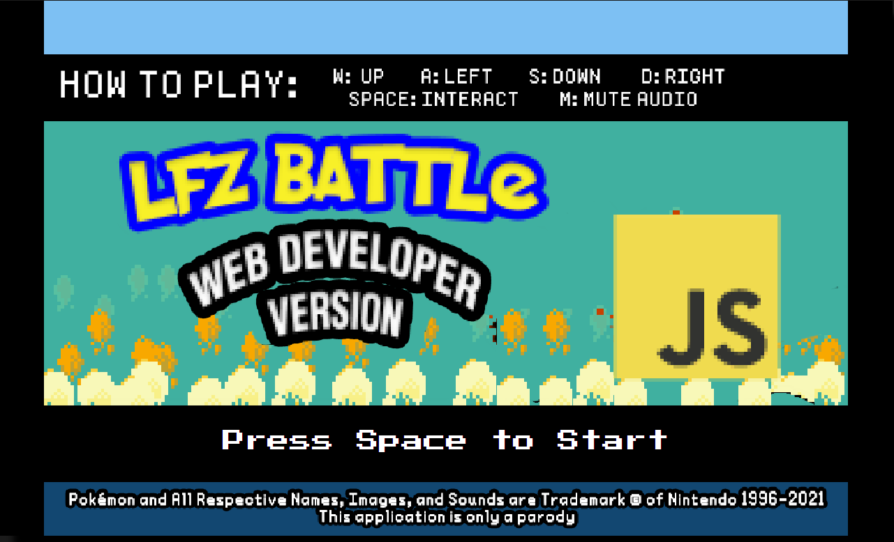
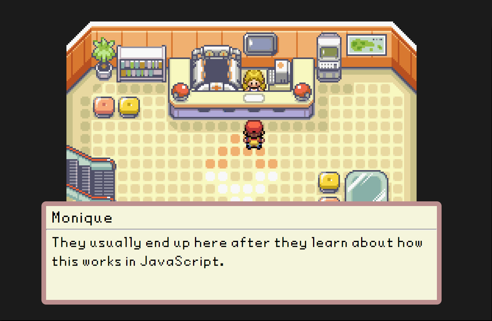
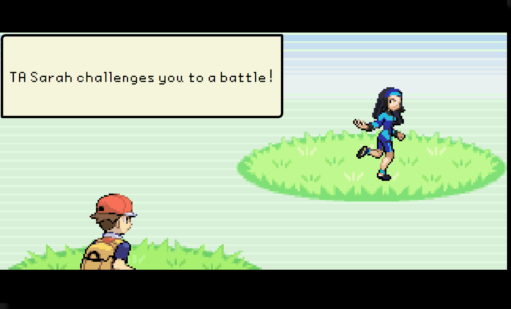
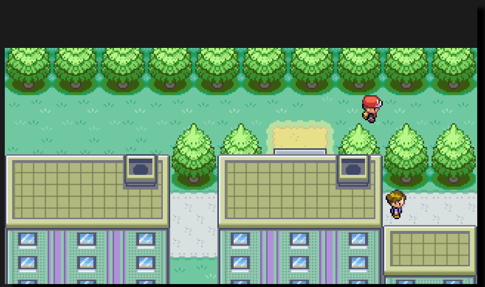

# LFZ Battle

A clone of Pokemon Fire Red but with programming questions instead of Pokemon.
Built with vanilla TypeScript.

  

    
  

## Disclaimer

  This game is only a parody.

  I am not affiliated with the Nintendo Company, all assets in this application were taken from third party websites and not from the game itself.

  If you are someone from Nintendo and would like the website taken down please email me <a href="mailto:uzinatorcl@gmail.com">here</a> and I shall do so.

  Pokemon and All Respective Names, Images, and Sounds are Trademark &copy; of Nintendo 1996 - 2021.

## A little bit of background

I've been an instructor at LearningFuze for more than a year now.  This game is a small collection of memories and experiences I have had working here.  I had the idea of creating a game where you can battle the instructors a long time ago but I didn't have the skill at the time.  After alot of grinding I was finally able to pull it off.

The code is somewhat messy in my opinion.  I spent a few weeks reading about design patterns and game engines and kind of funneled all my knowledge into this game.  I didn't exactly plan anything, I just sat at my computer one Friday night and started prototyping.  I didn't really stop prototyping and here we are.

There are some portions that are really overcomplicated and some bandaid fixes that I'm not super proud of, but I will go back to refactor someday.

As of now the game is for desktop only, I had planned the ability to play on mobile, but at this point I'm a little burnt out and working with loading sounds on iOS Safari and touch events is kind of not working with my brain right now.  But it will be the next feature when I some more free time.

Thanks for reading, please enjoy!

## Technologies Used

- Typescript
- Webpack
- Babel

## Live

Try the application live [here](https://lfz-battle.uzairashraf.dev/)

## How to Play

- WASD - Move your character around
- M - Unmute/Mute audio
- SPACE - Interact with NPCs

## Features

- User can preload assets
- User can walk around map
- User can transition between maps
- User can interact with npcs
- User can battle npcs
- User can hear audio
- User can battle gym leaders

## In-Game Screenshots

  

    
  

  

    
  

  

    
  

